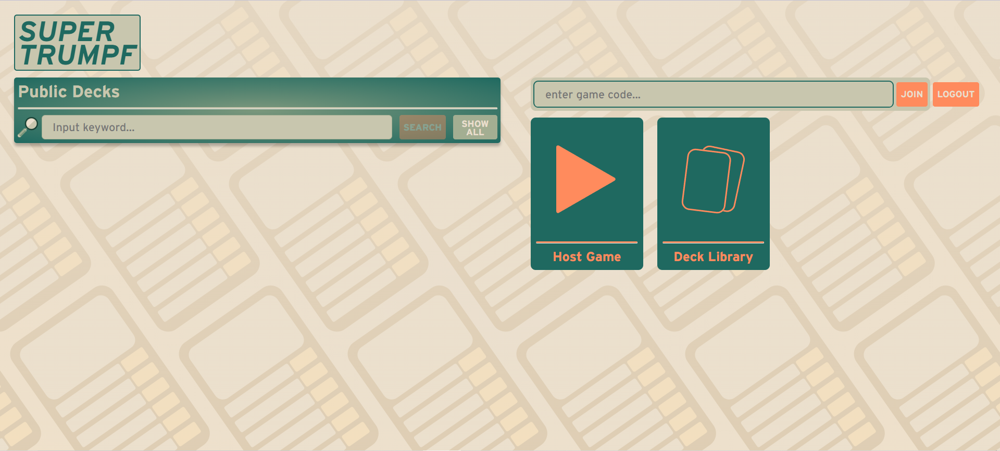
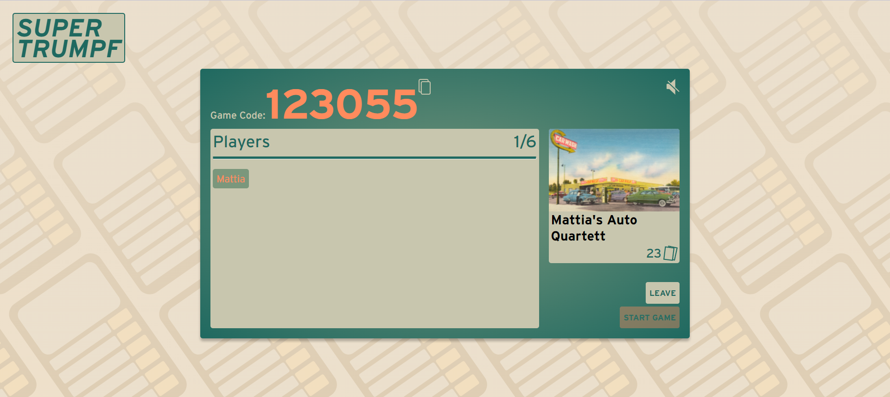
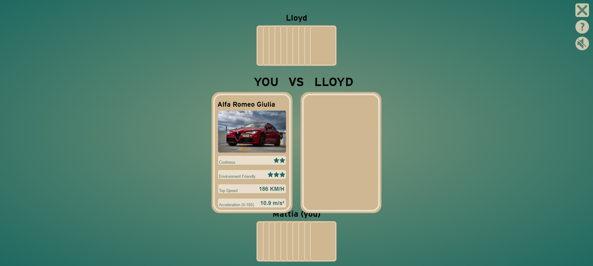

# Supertrumpf

## Overview
Supertrumpf is a browser based multiplayer card game that can be played between 2-5 people. It allows players to play and create cards and decks for themselves,
which can be shared with others and made public for others to use.

The game has its root in the physical card game better known as 'Autoquartett',
which we wanted to bring to the digital world so that friends independent of their geographical location can play together.
We not only wanted a simple card game, but a total expirience which is rounded off by being able to creating card decks and sharing them among yor friends.
Our goal is to have:
- a playable game
- functioning deck creation tool
- sharing decks among peers

## Technologies
For client the main technologies used are React and npm.

## Prerequisites and Launch
For local development environment, you will need Node.js. You can download it [here](https://nodejs.org). All other dependencies, including React, get installed with:

```npm install```

Run this command before you start your application for the first time. Next, you can start the app with:

```npm run dev```

Now you can open [http://localhost:3000](http://localhost:3000) to view it in the browser.

Notice that the page will reload if you make any edits. You will also see any lint errors in the console (use Google Chrome).

Finally, `npm run build` builds the app for production to the `build` folder.<br>
It correctly bundles React in production mode and optimizes the build for the best performance: the build is minified, and the filenames include hashes.<br>

See the section about [deployment](https://facebook.github.io/create-react-app/docs/deployment) for more information.

##High-level components
Most of the code can be found in the views directory. The [Game.js](https://github.com/sopra-fs22-group-10/client/blob/master/src/components/views/Game.js) is the main one for during the game and it employs most of the helper functions in the helpers directory.

If you want to change anything about the structure of the views, don't forget to change the mappings in the routers directory as well.

Card and deck creation is scattered among multiple views such as [CreateCard.js](https://github.com/sopra-fs22-group-10/client/blob/master/src/components/views/CreateCard.js), [DeckOverview.js](https://github.com/sopra-fs22-group-10/client/blob/master/src/components/views/DeckOverview.js) etc.

## Illustrations

This is the main "Dashboard" page

The lobby page includes buttons to turn on music and copy the game code to clipboard

in the game, select an opponent and a stat to play a round. There is also a help button, which explains the game and a button to turn on the music. Upon clicking the ```x``` button the game is deleted for all players, as playing when one player has left does not make sense.

## Roadmap
If you want to pick up where we left off, the main things you could improve on in our opinion are:

- Adding animations to the game
- Showing which player won a round and which stats were better
- Adding a deck fairness check

## Authors and Acknowledgement
[andreas-wiemeyer](https://github.com/andreas-wiemeyer)

[UlricaK](https://github.com/UlricaK)

[mattialeonetti](https://github.com/mattialeonetti)

[timvorburger](https://github.com/timvorburger)

[Atsrivi](https://github.com/Atsrivi)

>We are thankful to our TA [SamuelBruegger](https://github.com/SamuelBruegger) for his support during this project.

## License
MIT License

Copyright (c) 2022 Mattia Leonetti

Permission is hereby granted, free of charge, to any person obtaining a copy
of this software and associated documentation files (the "Software"), to deal
in the Software without restriction, including without limitation the rights
to use, copy, modify, merge, publish, distribute, sublicense, and/or sell
copies of the Software, and to permit persons to whom the Software is
furnished to do so, subject to the following conditions:

The above copyright notice and this permission notice shall be included in all
copies or substantial portions of the Software.

THE SOFTWARE IS PROVIDED "AS IS", WITHOUT WARRANTY OF ANY KIND, EXPRESS OR
IMPLIED, INCLUDING BUT NOT LIMITED TO THE WARRANTIES OF MERCHANTABILITY,
FITNESS FOR A PARTICULAR PURPOSE AND NONINFRINGEMENT. IN NO EVENT SHALL THE
AUTHORS OR COPYRIGHT HOLDERS BE LIABLE FOR ANY CLAIM, DAMAGES OR OTHER
LIABILITY, WHETHER IN AN ACTION OF CONTRACT, TORT OR OTHERWISE, ARISING FROM,
OUT OF OR IN CONNECTION WITH THE SOFTWARE OR THE USE OR OTHER DEALINGS IN THE
SOFTWARE.
